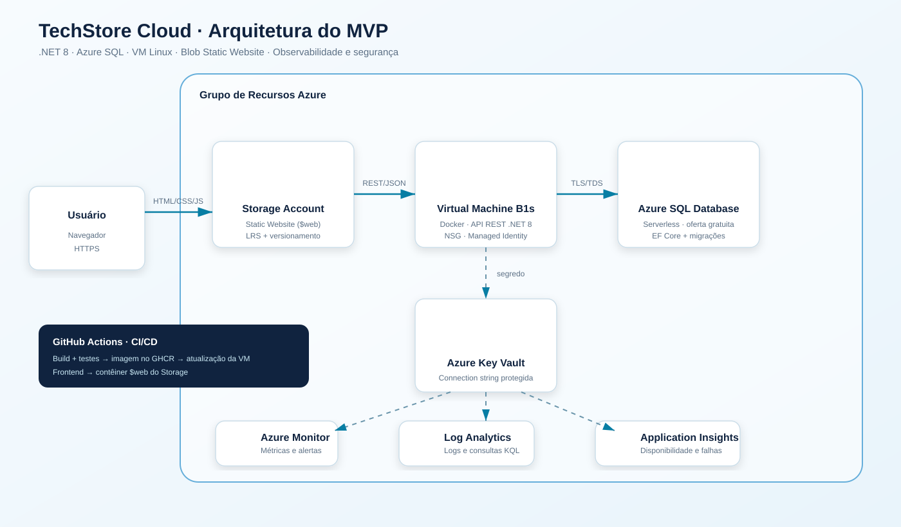

# Arquitetura — TechStore Cloud

## Decisões do MVP

| Necessidade | Escolha | Justificativa e trade-off |
|---|---|---|
| Frontend Angular | Azure Blob Storage Static Website, Standard LRS | O build gera HTML/CSS/JS estáticos, com baixo custo e sem servidor. LRS reduz custo, mas não protege contra indisponibilidade regional. |
| API REST | .NET 8 em contêiner Docker sobre VM Linux B1s | Atende literalmente ao requisito de VM e ao limite gratuito inicial. Exige patching e administração do SO. |
| Dados relacionais | Azure SQL Database General Purpose serverless | Integridade relacional, backup e patching gerenciados. O modo gratuito pausa ao esgotar o limite mensal. |
| Segredos | Key Vault + identidade gerenciada da VM | Evita senha no código/repositório. A identidade tem somente leitura de segredos. |
| Rede | VNet, subnet, NSG e proxy Caddy | HTTP/HTTPS públicos e SSH restrito ao IP administrativo. O Caddy emite o certificado TLS sem criar outro recurso pago. |
| Observabilidade | Azure Monitor Agent, Log Analytics e Application Insights | Logs centralizados, métricas e teste de disponibilidade. Retenção de 30 dias limita custo. |
| Entrega | GitHub Actions + Bicep | Build/teste e implantação repetíveis, auditáveis e versionados. |

O frontend segue separação por responsabilidade: `core/models` contém contratos, `core/services` concentra o acesso HTTP, `pages/products` implementa a tela do caso de uso e `shared/components` reúne componentes reutilizáveis. A API permanece independente e é publicada com HTTPS pelo Caddy na VM, evitando bloqueio de conteúdo misto no site estático do Storage.

## Comparação de computação Azure

- **Virtual Machines:** máximo controle e compatibilidade; maior esforço operacional. Escolhida porque a prova exige VM.
- **App Service:** PaaS ideal para uma API web, com deploy e escala simplificados; seria a primeira evolução em produção.
- **Functions:** indicada para tarefas orientadas a eventos e execução curta, como processar uma fila de atualização de estoque.
- **Container Apps:** boa opção serverless para microsserviços em contêiner, com escala a zero e menos operação que VM.
- **AKS:** adequado quando há muitos microsserviços e necessidade real de Kubernetes; complexo e caro demais para este MVP.

## Armazenamento Azure

- **Blob:** objetos e site estático; suporta Hot/Cool/Cold/Archive, versionamento e LRS/ZRS/GRS/GZRS. É a escolha do frontend.
- **Files:** compartilhamento SMB/NFS gerenciado para aplicações legadas e lift-and-shift.
- **Table:** chave/atributo NoSQL barato para dados simples e sem joins.
- **Queue:** mensagens assíncronas para desacoplar serviços; evolução possível para processamento de catálogo.

## Dados: Azure SQL versus Cosmos DB

Azure SQL foi escolhido por consistência transacional, esquema conhecido, SKU único e consultas relacionais. Cosmos DB seria útil em escala global com baixa latência e esquema flexível; exigiria definir uma chave de partição (por exemplo, `categoryId`), estimar RUs e escolher nível de consistência. Para este cadastro pequeno, isso acrescentaria custo e complexidade sem benefício prático.

## Segurança, LGPD e governança

- Não há dados pessoais no produto; coleta mínima por desenho.
- TLS 1.2, segredo no Key Vault, identidade gerenciada, NSG e logs sem credenciais.
- Soft delete e purge protection no Key Vault.
- Para produção: Private Endpoints, Microsoft Defender for Cloud, Microsoft Entra ID no SQL, Azure Policy para regiões/tags/TLS e orçamento com alertas. O MVP já usa HTTPS automático com Caddy.
- Landing Zone é a evolução para múltiplos ambientes/assinaturas. Azure Blueprints foi substituído por abordagens baseadas em Template Specs, Deployment Stacks e Azure Policy.

## Azure Well-Architected

| Pilar | Aplicação atual | Evolução priorizada |
|---|---|---|
| Confiabilidade | Health checks, HTTPS e banco gerenciado | Backup testado e zona redundante quando houver orçamento |
| Segurança | Key Vault, identidade e menor exposição de portas | Private Endpoints, Entra ID, Defender e WAF |
| Otimização de custos | B1s, LRS, SQL gratuito auto-pause | Alertas de orçamento e desligamento agendado da VM |
| Excelência operacional | IaC, CI/CD, migrações e logs | Ambientes dev/homologação/prod e runbooks |
| Eficiência de desempenho | Paginação, busca e índices de SKU | Cache e escala horizontal em App Service/Container Apps |

## Plano de evolução

1. **Antes da apresentação:** provisionar, publicar, testar CRUD e coletar evidências.
2. **Curto prazo:** HTTPS, domínio, alertas de custo e disponibilidade, Policy e Defender.
3. **Médio prazo:** mover API para App Service ou Container Apps e banco para acesso privado.
4. **Quando houver demanda:** fila para eventos de estoque, cache e réplica/região adicional com análise de custo.

Os ícones no diagrama vêm do pacote oficial de [Azure Architecture Icons](https://learn.microsoft.com/azure/architecture/icons/), permitido pela Microsoft para diagramas e documentação.
